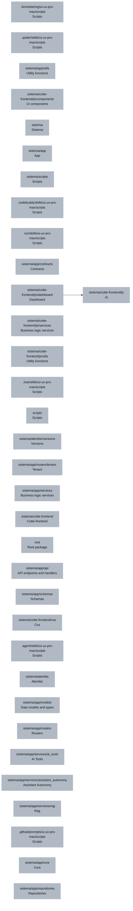

# Projeto-izi dependency graph

> Generated by [stacklit](https://github.com/glincker/stacklit) on 2026-05-09. Run `stacklit generate` to update.

```mermaid
graph LR
  classDef python fill:#b1bac4,color:#0d1117,stroke:#b1bac4
  classDef javascript fill:#c9d1d9,color:#0d1117,stroke:#c9d1d9
  kiro_steering_ui_ux_pro_max_scripts[".kiro/steering/ui-ux-pro-max/scripts<br/>Scripts"]:::python
  qoder_skills_ui_ux_pro_max_scripts[".qoder/skills/ui-ux-pro-max/scripts<br/>Scripts"]:::python
  sistema_app_utils["sistema/app/utils<br/>Utility functions"]:::python
  sistema_cotte_frontend_js["sistema/cotte-frontend/js<br/>Js"]:::python
  sistema_cotte_frontend_js_components["sistema/cotte-frontend/js/components<br/>UI components"]:::python
  sistema["sistema<br/>Sistema"]:::python
  sistema_app["sistema/app<br/>App"]:::python
  sistema_scripts["sistema/scripts<br/>Scripts"]:::python
  codebuddy_skills_ui_ux_pro_max_scripts[".codebuddy/skills/ui-ux-pro-max/scripts<br/>Scripts"]:::python
  roo_skills_ui_ux_pro_max_scripts[".roo/skills/ui-ux-pro-max/scripts<br/>Scripts"]:::python
  sistema_app_contracts["sistema/app/contracts<br/>Contracts"]:::python
  sistema_cotte_frontend_js_dashboard["sistema/cotte-frontend/js/dashboard<br/>Dashboard"]:::python
  sistema_cotte_frontend_js_services["sistema/cotte-frontend/js/services<br/>Business logic services"]:::python
  sistema_cotte_frontend_js_utils["sistema/cotte-frontend/js/utils<br/>Utility functions"]:::python
  trae_skills_ui_ux_pro_max_scripts[".trae/skills/ui-ux-pro-max/scripts<br/>Scripts"]:::python
  scripts["scripts<br/>Scripts"]:::python
  sistema_alembic_versions["sistema/alembic/versions<br/>Versions"]:::python
  sistema_app_routers_tenant["sistema/app/routers/tenant<br/>Tenant"]:::python
  sistema_app_services["sistema/app/services<br/>Business logic services"]:::python
  sistema_cotte_frontend["sistema/cotte-frontend<br/>Cotte-frontend"]:::python
  root["root<br/>Root package"]:::python
  sistema_app_api["sistema/app/api<br/>API endpoints and handlers"]:::python
  sistema_app_schemas["sistema/app/schemas<br/>Schemas"]:::python
  sistema_cotte_frontend_css["sistema/cotte-frontend/css<br/>Css"]:::python
  agent_skills_ui_ux_pro_max_scripts[".agent/skills/ui-ux-pro-max/scripts<br/>Scripts"]:::python
  sistema_alembic["sistema/alembic<br/>Alembic"]:::python
  sistema_app_models["sistema/app/models<br/>Data models and types"]:::python
  sistema_app_routers["sistema/app/routers<br/>Routers"]:::python
  sistema_app_services_ai_tools["sistema/app/services/ai_tools<br/>Ai Tools"]:::python
  sistema_app_services_assistant_autonomy["sistema/app/services/assistant_autonomy<br/>Assistant Autonomy"]:::python
  sistema_app_services_rag["sistema/app/services/rag<br/>Rag"]:::python
  github_prompts_ui_ux_pro_max_scripts[".github/prompts/ui-ux-pro-max/scripts<br/>Scripts"]:::python
  sistema_app_core["sistema/app/core<br/>Core"]:::python
  sistema_app_repositories["sistema/app/repositories<br/>Repositories"]:::python
  sistema_cotte_frontend_js_dashboard --> sistema_cotte_frontend_js
```
