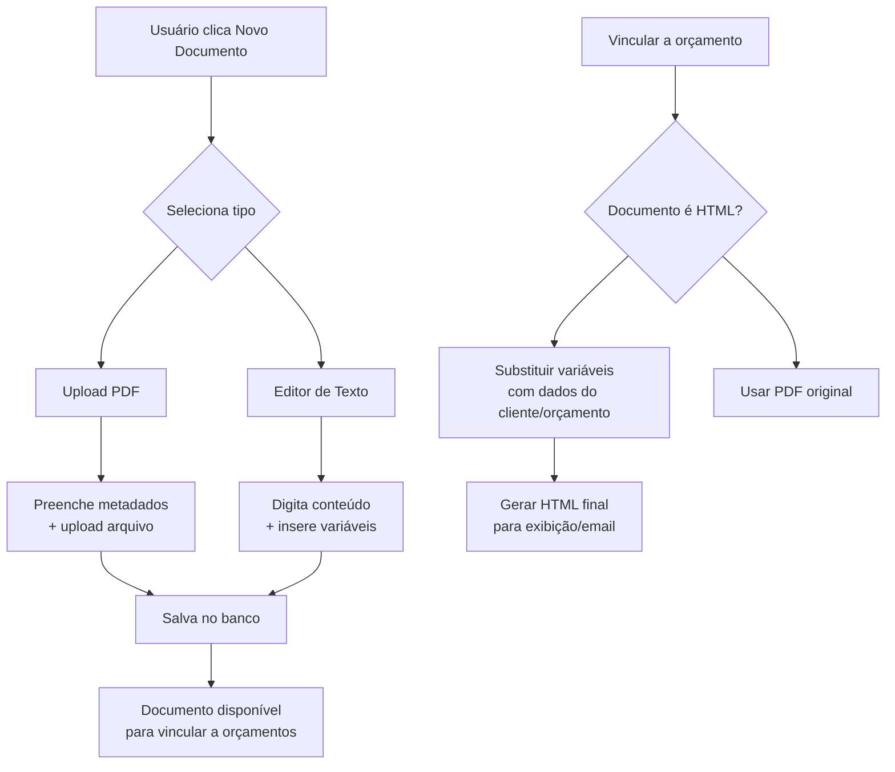

---
title: Editor Documentos Plano
tags:
  - roadmap
prioridade: media
status: documentado
---
# Plano de Implementação: Editor de Texto Rico para Modelos de Documentos

## Objetivo
Implementar um campo de formulário interativo (mini editor WYSIWYG) para cadastro de modelos de documentos padrão (contrato, certificado de garantia, termos de serviço) com suporte a formatação básica e variáveis dinâmicas.

## Análise do Estado Atual
- Sistema atual permite apenas upload de PDFs como documentos.
- Tabela `documentos_empresa` armazena metadados e caminho do arquivo.
- Frontend: `cotte-frontend/documentos.html` com modal de upload.
- Backend: API REST em `app/routers/documentos.py`.

## Requisitos Funcionais
1. **Editor de texto rico** com formatação básica (negrito, itálico, sublinhado, listas).
2. **Inserção de variáveis** via botão dropdown (ex: `{nome_cliente}`, `{valor_orcamento}`, `{data}`).
3. **Armazenamento** do conteúdo HTML no banco de dados.
4. **Substituição dinâmica** das variáveis ao utilizar o modelo em um orçamento.
5. **Pré-visualização** do documento com dados de exemplo.
6. **Compatibilidade** com documentos PDF existentes (modo misto).

## Arquitetura Técnica

### Frontend
- **Biblioteca**: Quill.js (via CDN) – leve, fácil integração.
- **Toolbar personalizada**:
  - Negrito, itálico, sublinhado
  - Lista com marcadores, lista numerada
  - Botão "Inserir variável" com dropdown
  - Limpar formatação
- **Integração no modal**:
  - Adicionar abas: "Upload PDF" e "Editor de Texto"
  - Seletor de tipo de conteúdo (PDF/HTML)
  - Área do editor (altura: 300px)
- **Pré-visualização**:
  - Botão "Visualizar" que abre modal com HTML renderizado
  - Substitui variáveis por dados fictícios

### Backend
#### Modificações no Banco de Dados
1. Adicionar colunas à tabela `documentos_empresa`:
   - `conteudo_html` (TEXT) – conteúdo HTML do editor
   - `tipo_conteudo` (ENUM: 'pdf', 'html') – tipo do documento
   - `variaveis_suportadas` (JSON) – lista de variáveis usadas (opcional)
2. Criar migration Alembic.

#### Modelo e Schema
- Atualizar `DocumentoEmpresa` no `models.py` com novos campos.
- Atualizar `DocumentoEmpresaOut` e `DocumentoEmpresaUpdate` no `schemas.py`.
- Criar enum `TipoConteudoDocumento`.

#### API
- **POST /documentos/**: Aceitar parâmetro `tipo_conteudo` e `conteudo_html` (se tipo='html').
- **PUT /documentos/{id}**: Atualizar conteúdo HTML.
- **GET /documentos/{id}/preview**: Retornar HTML com variáveis substituídas por valores de exemplo.
- **POST /documentos/{id}/substituir**: Substituir variáveis com dados fornecidos (cliente, orçamento).

#### Serviço de Substituição
- Função `substituir_variaveis(html: str, contexto: dict) -> str`:
  - Regex para encontrar padrões `{variavel}`.
  - Substituir por valores do contexto.
  - Preservar formatação HTML.

### Fluxo de Uso

## Plano de Implementação Detalhado

### Fase 1: Preparação (1 dia)
1. **Analisar dependências**:
   - Verificar se Quill.js é compatível com tema dark/light.
   - Definir versão CDN (ex: `https://cdn.quilljs.com/1.3.7/quill.min.js`).
2. **Criar migration**:
   - Script Alembic para adicionar colunas.
   - Testar rollback.
3. **Atualizar modelos e schemas**:
   - Adicionar campos no SQLAlchemy.
   - Atualizar Pydantic schemas.

### Fase 2: Backend (2 dias)
1. **Extender API de documentos**:
   - Modificar endpoint POST para aceitar `conteudo_html` e `tipo_conteudo`.
   - Validação: se tipo='html', `conteudo_html` é obrigatório; se tipo='pdf', `arquivo` é obrigatório.
2. **Implementar serviço de substituição**:
   - Criar `app/services/documentos_substituicao.py`.
   - Função de substituição com regex.
   - Lista de variáveis padrão (cliente, orçamento, empresa, data).
3. **Criar endpoints de preview/substituição**:
   - `GET /documentos/{id}/preview` (dados fictícios).
   - `POST /documentos/{id}/substituir` (dados reais).
4. **Testes unitários**:
   - Testar substituição com HTML complexo.
   - Testar validações.

### Fase 3: Frontend (3 dias)
1. **Modificar modal de documentos**:
   - Adicionar tabs "PDF" e "Editor de Texto".
   - Mostrar/ocultar campos conforme tab ativa.
2. **Integrar Quill.js**:
   - Incluir CDN no `documentos.html`.
   - Inicializar editor com toolbar customizada.
   - Botão dropdown de variáveis.
3. **Implementar pré-visualização**:
   - Botão "Visualizar" que chama endpoint de preview.
   - Modal com renderização segura (iframe ou div com `innerHTML` sanitizado).
4. **Ajustar lógica de salvamento**:
   - Coletar `conteudo_html` do editor.
   - Enviar `tipo_conteudo` adequado.
5. **Estilização**:
   - Integrar editor ao tema (cores, bordas).
   - Responsividade.

### Fase 4: Integração com Orçamentos (1 dia)
1. **Modificar vinculação de documentos**:
   - Ao vincular documento HTML a um orçamento, substituir variáveis automaticamente.
   - Exibir versão preenchida no PDF gerado (requer conversão HTML→PDF).
2. **Conversão HTML para PDF** (opcional):
   - Usar serviço de PDF existente (WeasyPrint?).
   - Ou manter como HTML para exibição no portal.

### Fase 5: Testes e Ajustes (1 dia)
1. **Testes manuais**:
   - Criar documento HTML, inserir variáveis, visualizar.
   - Vincular a orçamento, verificar substituição.
   - Compatibilidade com dark mode.
2. **Correções de bugs**.
3. **Documentação**:
   - Atualizar `README.md` com nova funcionalidade.
   - Guia de uso de variáveis.

## Considerações de Design
- **Usabilidade**: Editor simples, não sobrecarregar usuário.
- **Performance**: Quill.js é leve; conteúdo HTML armazenado como texto.
- **Segurança**: Sanitizar HTML antes de salvar (remover scripts).
- **Mantibilidade**: Código modular, separação de responsabilidades.

## Riscos e Mitigações
- **Risco**: Quill.js conflito com bibliotecas existentes.
  - **Mitigação**: Testar em ambiente de desenvolvimento.
- **Risco**: Substituição de variáveis corromper formatação.
  - **Mitigação**: Usar regex preciso e testes extensivos.
- **Risco**: Tamanho do conteúdo HTML muito grande.
  - **Mitigação**: Limitar tamanho no backend (15MB).

## Próximos Passos
1. Revisar plano com equipe.
2. Implementar migration.
3. Desenvolver backend.
4. Desenvolver frontend.
5. Testes integrados.
6. Deploy em staging.

## Referências
- [Quill.js Documentation](https://quilljs.com/docs/)
- [FastAPI Upload File + JSON](https://fastapi.tiangolo.com/tutorial/request-files/)
- [Regex para substituição de variáveis](https://regex101.com/)

---
*Plano elaborado em 20/03/2026*