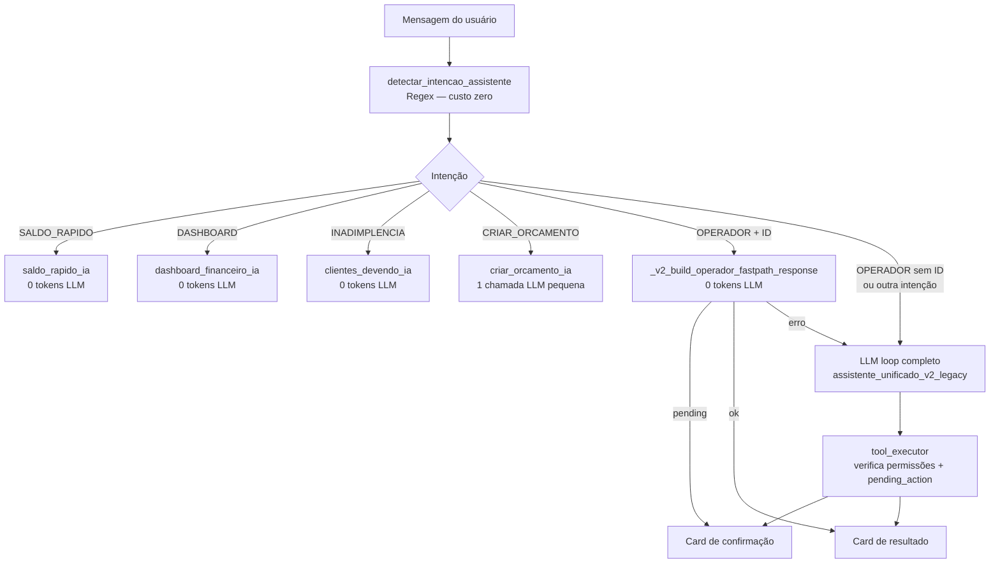

# Assistente IA — Arquitetura e Guia de Manutenção

> **Lei de ouro**: toda alteração no assistente deve ser testada nos cenários da tabela de verificação ao final deste arquivo. Qualquer mudança que quebre um desses cenários é uma regressão e não deve ser mergeada.

---

## 1. Fluxo Geral de Intenção



---

## 2. Arquivos Críticos — o que cada um faz

| Arquivo | Responsabilidade |
|---|---|
| `app/services/ai_intention_classifier.py` | Regex determinístico → classifica intenção sem LLM. **Nunca adicione chamadas de rede aqui.** |
| `app/services/cotte_ai_hub.py` | Orquestra fast-paths e loop LLM. Contém `assistente_unificado_v2` e todas as funções `_v2_*`. |
| `app/services/tool_executor.py` | Executa tools validando permissão, gerencia `_PENDING_TOKENS` (confirmação). |
| `app/services/ai_tools/*.py` | Definição de cada tool (schema + handler). **Um arquivo por domínio.** |
| `cotte-frontend/js/assistente-ia-render.js` | Renderiza a resposta do backend no chat (cards, confirmações, sugestões). |
| `cotte-frontend/js/assistente-ia-render-types.js` | Templates HTML dos cards de orçamento (`renderOrcamentoCardUnificado`, `renderOperadorResultado`). |
| `cotte-frontend/js/assistente-ia-shell.js` | Event listeners do chat (click, quick-send, data-confirm-ia). |
| `cotte-frontend/js/assistente-ia-actions.js` | Ações diretas sem LLM: `enviarPorWhatsapp`, `enviarPorEmail`, `confirmarOrcamento`. |

---

## 3. Fast-paths Existentes

Cada fast-path economiza 3 000–9 000 tokens por chamada. **Crie um fast-path para qualquer intenção de alto volume que não precise de raciocínio contextual.**

| Fast-path | Trigger (regex em `ai_intention_classifier.py`) | Handler | Tokens LLM |
|---|---|---|---|
| Saldo rápido | `saldo`, `caixa`, `quanto tenho` | `saldo_rapido_ia` | 0 |
| Dashboard | `dashboard`, `visão geral`, `resumo financeiro` | `dashboard_financeiro_ia` | 0 |
| Inadimplência | `devendo`, `atrasado`, `quem deve` | `clientes_devendo_ia` | 0 |
| Criar orçamento | `orçamento para`, `orçamento de`, `orçar` | `criar_orcamento_ia` | ~300 |
| OPERADOR c/ ID | `aprovar ORC-N`, `ver ORC-N`, `recusar ORC-N` | `_v2_build_operador_fastpath_response` | 0 |

### Como adicionar um novo fast-path

1. Garanta que `ai_intention_classifier.py` já classifica a intenção corretamente (adicione keyword se necessário).
2. Em `cotte_ai_hub.py`, adicione `def _v2_is_XXXXX_message(mensagem)` e `async def _v2_build_XXXXX_response(...)`.
3. Adicione o bloco `if _v2_is_XXXXX_message(mensagem): ...` em `assistente_unificado_v2`, **antes** da chamada a `semantic_autonomy`.
4. Teste todos os cenários da tabela de verificação.

---

## 4. Sistema de Contexto e Tokens

O LLM recebe múltiplas camadas de contexto. Cada camada adiciona tokens:

| Camada | Tokens estimados | Condição |
|---|---|---|
| `_V2_MINIMAL_SYSTEM_PROMPT` | ~150 | `prompt_strategy == "minimal"` |
| `_V2_SYSTEM_PROMPT` (completo) | ~800 | `prompt_strategy == "standard"` |
| `semantic_ctx` (memória empresa) | ~500–1500 | `allow_context_enrichment == True` |
| `adaptive_ctx` (prefs usuário) | ~300–600 | `allow_context_enrichment == True` |
| `rag_ctx` (documentos) | ~800–2000 | flag `tenant_rag` ativada |
| Tool definitions (~15 tools) | ~3000–4500 | sempre |
| Histórico (janela) | ~500–2000 | últimas 2–12 mensagens |

**`allow_context_enrichment = (prompt_strategy != "minimal")`**

Intenções em `_V2_MINIMAL_INTENTS` com ≤18 palavras usam `prompt_strategy = "minimal"` e **não carregam** `semantic_ctx` nem `adaptive_ctx`, economizando 1000–3000 tokens.

---

## 5. Pipeline NLU de Orçamento

Quando a intenção é `CRIAR_ORCAMENTO`:

```
criar_orcamento_ia(mensagem)
   └─ ai_hub.processar("orcamentos", mensagem, confianca_minima=0.3)
         ├─ LLM extrai JSON: {cliente_nome, servico, valor, confianca}
         ├─ [fallback] se LLM falhar → FallbackManual.extrair_orcamento()
         │      ├─ valor: padrões "R$N", "N reais", "por N", "N mil"
         │      ├─ nome: "para <nome>" (case-insensitive, suporta acentos)
         │      └─ serviço: lista predefinida OU "de <algo>"
         └─ AntiDeliriumSystem (4 camadas de validação)
               └─ rejeita apenas se NENHUM dado útil foi extraído
```

**Regra**: a mensagem só é rejeitada se `servico`, `valor` e `cliente_nome` forem todos vazios/zero.

---

## 6. Fluxo de Confirmação (pending_action)

Toda tool marcada `destrutiva=True` em `ai_tools/*.py` retorna `requires_confirmation`. O fluxo é:

```
LLM chama tool  →  tool_executor.execute()
                       └─ destrutiva=True → _issue_token(tool, args)
                              └─ retorna ToolResult(status="pending", pending_action={...})
                                     └─ AIResponse.pending_action enviada ao frontend
                                            └─ Usuário clica "Confirmar"
                                                   └─ POST /ai/assistente com confirmation_token
                                                          └─ execute_pending(token) → executa sem LLM
```

O fast-path do OPERADOR **reutiliza o mesmo mecanismo**: chama `tool_execute` diretamente, que emite o token da mesma forma. Resultado idêntico ao do fluxo LLM, mas sem custo.

---

## 7. Regras Invariáveis (NÃO ALTERAR)

1. **`_PENDING_TOKENS`** em `tool_executor.py` é in-memory. Tokens expiram em 15 min. Nunca armazene confirmation_tokens em banco.
2. **`detectar_intencao_assistente`** deve ser síncrono e custo zero (apenas regex). Nunca adicione I/O.
3. **`confianca_minima=0.3`** em `criar_orcamento_ia`. Não aumente: bloqueia orçamentos com serviços fora da lista padrão.
4. **Fast-paths são verificados ANTES de `semantic_autonomy`**. Nunca mova um fast-path para depois desse check.
5. **`FallbackManual.extrair_orcamento`** é o último recurso quando o LLM falha. Deve sempre retornar um dict (mesmo que vazio).
6. **Botões `data-enviar-wa`** → `enviarPorWhatsapp()` (API direta, sem LLM). **Botões `data-quick-send`** → `sendQuickMessage()` (via LLM/fast-path).

---

## 8. Tabela de Verificação (testar após cada mudança)

| # | Mensagem / Ação | Resultado esperado | Tokens LLM |
|---|---|---|---|
| 1 | "caixa" | Saldo formatado | 0 |
| 2 | "resumo" | Dashboard financeiro | 0 |
| 3 | "devendo" | Lista de inadimplentes | 0 |
| 4 | "orçamento para João de pintura por 500" | Preview card (cliente=João, serviço=pintura, valor=500) | ~300 |
| 5 | "orçamento para otavio de um cartão por 15" | Preview card (cliente=Otavio, serviço=cartão, valor=15) | ~300 |
| 6 | "aprovar ORC-172" (botão ou digitado) | Card de confirmação compacto | 0 |
| 7 | Clicar "Confirmar" no card anterior | Orçamento aprovado, card atualizado | 0 |
| 8 | "ver ORC-172" | Card com detalhes do orçamento | 0 |
| 9 | "aprovar" (sem número) | Resposta LLM pedindo o número | >0 |
| 10 | Card de orçamento aprovado | Sem botão 🔍 Preview duplicado, sem whitespace excessivo | — |
| 11 | Pergunta financeira complexa | Resposta com dados reais, sem tokens fabricados | >0 |
| 12 | Botão 💬 Whats no card | Envio direto via API (sem LLM, sem token exibido) | 0 |

---

## 9. Mapa de Dependências entre Arquivos

```
assistente-ia.html
  └─ assistente-ia.js          (estado, sessaoId, envio)
  └─ assistente-ia-shell.js    (event listeners, quick-send, confirm)
  └─ assistente-ia-render.js   (renderiza resposta do backend)
  └─ assistente-ia-render-types.js (templates de cards)
  └─ assistente-ia-actions.js  (ações diretas: WhatsApp, email, confirmar)
  └─ assistente-ia-input.js    (textarea, voz, slash-commands)

Backend (ai_hub.py)
  └─ ai_intention_classifier.py   (classifica intenção)
  └─ tool_executor.py             (executa tools + pending tokens)
  └─ ai_tools/orcamento_tools.py  (handlers de orçamento)
  └─ ai_tools/financeiro_tools.py (handlers financeiros)
  └─ cotte_context_builder.py     (SessionStore + SemanticMemory)
```
